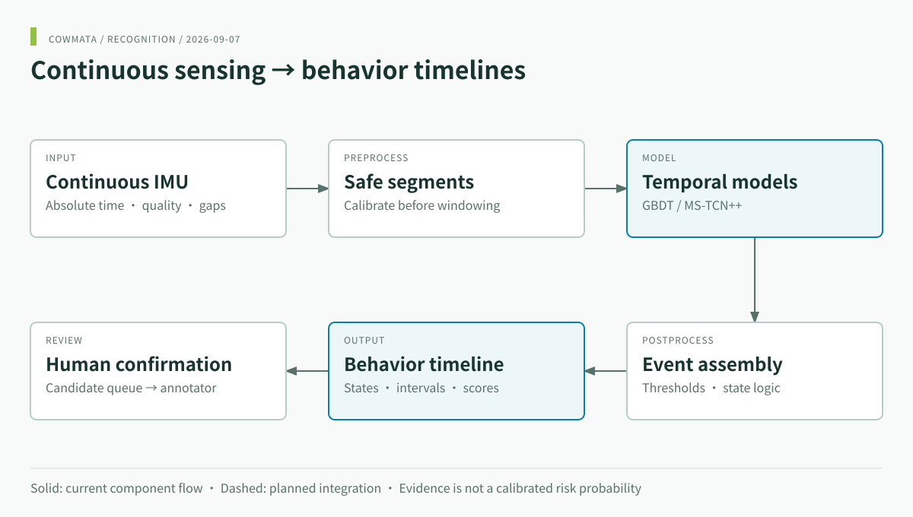

<div align="center">
<a href="https://www.cowmata.com/"></a>

# COWMATA · Behavior & Event Recognition

**Continuous IMU → posture states, event intervals and review candidates.**

[](https://github.com/zxq309/cowmata-tailring/actions/workflows/ci.yml)


[English](README.md) · [简体中文](README.zh-CN.md) · [COWMATA](https://github.com/zxq309/cowmata)

</div>



## Latest update

**2026-09-07** — Focused recognition documentation and bilingual pipeline diagrams; overall product imagery moved to [cowmata](https://github.com/zxq309/cowmata). Windows model-path repair retained. [Full changelog](CHANGELOG.md). Latest tagged software: [v0.3.1](https://github.com/zxq309/cowmata-tailring/releases/tag/v0.3.1); this documentation update does not retrain models.

## Scope and outputs

This repository owns continuous behavior recognition: preprocessing, feature/model training, inference, event assembly and cow-independent evaluation. Reproductive/health decisions belong in [cowmata-risk](https://github.com/zxq309/cowmata-risk); the product roadmap belongs in [cowmata](https://github.com/zxq309/cowmata).

| Output | Codes / format |
|---|---|
| Persistent state | `STANDING`, `LYING`, `WALKING` |
| Transitions | `STANDING_UP`, `LYING_DOWN` |
| Events | `URINATION`, `DEFECATION`, `TAIL_RAISED` |
| Research heads | `MOUNTING`, `MOUNTED_BY`; dataset support does not imply validated performance |
| Files | Dense probabilities + candidate event intervals |

`TAIL_WAGGING` remains readable for compatibility but is excluded from current training. Candidates require human review in the [annotator](https://github.com/zxq309/cattle-tail-ring-annotator).

## Quick start

```sh
git clone https://github.com/zxq309/cowmata-tailring.git
cd cowmata-tailring
conda env create -f environment.yml
conda activate cowmata
python -m pip install -e . --no-deps
cowmata predict --cache-key demo_session_60s --data-root examples/demo_data --out runs/demo
```

The bundled demo produces 120 dense prediction points and candidate intervals. It checks execution, not field accuracy. Deep training additionally needs the matching PyTorch build. [Full commands and Python API](docs/QUICKSTART.en.md).

## Models and evaluation

The default GBDT annotation-assistance artifact is in `weights/deploy/gbdt_full.joblib`. The historical TCN checkpoint is provenance-only and not a deployable replacement. Versions and SHA-256 are in [MANIFEST.json](weights/MANIFEST.json).

Preserve continuous sensing, never cross gaps, split by cow, and evaluate independent events. Read the [data contract](docs/DATA_CONTRACT.md), [metric definitions](docs/METRICS.md), [experiment report](docs/EXPERIMENTS_20260819.md) and [maintenance verification](docs/MAINTENANCE_20260907.md). Historical results are exploratory; no new performance claim is made by this reorganization.

## Dataset

The full supervised cache stays out of Git: it is too large for ordinary Git and contains company, device, and animal identifiers. It is distributed as two Baidu Netdisk archives; everything a fresh clone needs to run ships in this repository.

| Artifact | Contents | Size | Distribution |
|---|---|---|---|
| `supervised_cache/session_cache/` | 132 continuous 50 Hz sessions — schema-2 `signal.i16.npy` (9-channel int16 counts) + `meta.json` (calibration, segments, `tail_position`) | ≈ 1.4 GB | [百度网盘 · session_cache](https://pan.baidu.com/s/1lnLpqO_UX5S57zmI1Qf_qw?pwd=u9n4)（提取码 `u9n4`） |
| `supervised_cache/samples.csv` | 351,128 supervised center points — cow / session / segment coordinates and per-event masks | ≈ 59 MB | [百度网盘 · samples.csv](https://pan.baidu.com/s/12mj-bflbcekc1x1_HI2NeQ?pwd=s5rd)（提取码 `s5rd`） |
| `supervised_cache/sessions.csv`, `dense_labels.csv.gz` | Session metadata and the dense label frame shared by the GBDT and deep branches | ≈ 7 MB | in this repository |
| `annotations/`, `loco_splits/`, `development_split/` | Adjudicated annotations and cow-level split manifests | small | in this repository |
| `examples/demo_data/…/demo_session_60s/` | 60 s real session (schema 1) for clone-ready smoke testing | ≈ 0.2 MB | in this repository |

To recover the full cache, extract both archives into `datasets/cowmata_imu/supervised_cache/` and run:

```bash
cowmata check-data --full-cache-scan
```

These artifacts are required for full retraining and real-data diagnostics — they are not obsolete cache waste. See [`docs/DATA_ACCESS.md`](docs/DATA_ACCESS.md) for delivery and integrity rules.

## Development

```sh
python -m pip install -e ".[dev,gbdt]"
pytest
cowmata predict --cache-key demo_session_60s --data-root examples/demo_data --out runs/check
```

## Repository map

- `cowmata/`: recognition package; `configs/`, `tests/`: configuration and checks.
- `weights/`: versioned models; `datasets/`: metadata and local data instructions.
- [Quick start](docs/QUICKSTART.en.md) · [Reference radar](docs/REFERENCE_PROJECTS.md).
- Legacy `cowmata/daily.py` and `experiments/fusion.py` stay for compatibility and historical reproducibility; they are not a new online decision service. New decision work belongs in cowmata-risk.
- [Contributing](CONTRIBUTING.md) · [Citation](CITATION.cff) · [Security](SECURITY.md) · [Notice](NOTICE).
