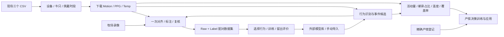

> **4.3.4**：新增独立算法引擎 `cowmata_engine`（行为识别 + 7 项特征产犊综合决策，JSON / 命令行 / 本机 HTTP 对接外部前端），9 种决策算法按牛验证并输出 6–48 h 校准概率与预计产犊时间。见 [决策引擎](docs/DECISION_ENGINE_433.md) · [接口](docs/ENGINE_API_433.md) · [真实数据结果](docs/DECISION_RESULTS_433.md)。

> **3.9.7**：原始录像逐段校验并归档到共享“录像”，临时视频使用目标盘；新增运行记录、耗时明细与归档结果，支持硬件转码和安全续跑。见 [发布说明](docs/release-397.md)。

# COWMATA Pro™ 3.9

**面向乳牛尾环监测的桌面工作台：从现场台账和原始传感器数据，完成录像标注、数据集构建、行为识别与产犊综合决策。**

项目把设备、牛只、采集时间、录像、人工标签和模型版本连接起来。操作者可以核对一条识别或风险结果来自哪份原始记录、哪个模型，以及哪些指标缺失。

[新手图文教程](docs/operator-guide-395.html) · [简要操作](docs/quick-start-390.md) · [发布下载](https://github.com/zxq309/COWMATA-Pro/releases) · [数据格式](docs/data-contract-390.md) · [验证记录](docs/validation-390.md)

> 产品名称为 **COWMATA Pro**。代码包保留 `cowmata_tailring` 名称，兼容已有工程和接口。三个历史仓库的介绍、实现说明与研究约束已归纳进本页，来源见[项目资料整合](docs/project/repository-consolidation.md)。

## 1. 项目解决什么问题

| 工作中的问题 | COWMATA Pro 的处理方式 |
|---|---|
| 下载时反复填写设备、耳标与现场标号 | 从三个现场 CSV 联合生成下载对象和佩戴时段 |
| 同一设备先后由不同牛佩戴 | 按采集时间匹配佩戴记录，身份冲突进入核对清单 |
| 录像与传感器时间不同 | 在同一个动作处做一次对齐，再跟随播放和标注 |
| 原始素材、人工标签和模型候选混淆 | 保留原始 JSON，候选单独存储，经人工复核形成标签 |
| 导出后难以追溯 | Raw/Label 配对，用原始内容 SHA-256 关联 |
| 训练数据、配置和评价散落 | 每次运行独立留档，展示全部训练记录、评价和图表 |
| 健康预测需要多种指标 | 先汇总行为、活动、姿态、温度与 PPG 证据，再应用决策模型 |
| GitHub 匿名 API 限流导致更新失败 | 回退到同仓库官方发布页，核验 SHA-256 后更新 |

## 2. 一眼看懂实现流程



实现分为五层：

1. **采集与身份层**：沿用已测通下载器的数据接口和上传器 1.1.0 的台账读取协议，统一设备编号、耳标、现场标号与有效佩戴范围。
2. **素材与时间层**：索引九轴、PPG 和录像，分别保存采集时钟、录像时钟及人工对齐关系。
3. **标注与数据集层**：草稿、候选和确认事件分开记录；保存历史、支持复核，导出可追溯的配对数据集。
4. **行为层**：Motion/PPG 分别提取对应特征，训练所选行为。独立识别、自动候选和产犊证据共用事件代码与导入模型。
5. **决策层**：按牛和时间窗汇总证据，显式记录缺失项；用产犊登记构造结局，训练并验证综合模型。

4.3.4 起，行为识别与综合决策算法集中在独立包 `cowmata_engine`（无 Qt 依赖）：7 项决策特征（心率、血氧、活动量、温度、躺卧占比、努责占比、角速度频谱熵）各为一个插件模块，决策层包含专家规则、基线偏离、逻辑回归、决策树、随机森林、极端随机树、AdaBoost、XGBoost、堆叠集成与剩余时间分位数回归。外部前端可用 `runtime\python.exe -m cowmata_engine serve` 启动本机 JSON 服务，或直接 `from cowmata_engine.api import handle`，见 [接口文档](docs/ENGINE_API_433.md)。

界面负责配置、呈现与人工确认。数值任务由独立工作进程执行，可取消，并限制 CPU 使用。原始数据、训练记录与模型保存在应用程序目录之外。

## 3. 安装与首次使用

### 普通使用者

从 [GitHub Releases](https://github.com/zxq309/COWMATA-Pro/releases) 下载安装包；便携包与纯净源码包由本地交付目录提供。三种包保持同一版本：

| 文件 | 用途 |
|---|---|
| `COWMATA-Pro-3.9.7-Setup.exe` | Windows 安装版，按向导安装 |
| `COWMATA-Pro-3.9.7-Portable.zip` | 完整解压到独立目录，运行其中的 `COWMATA.exe` |
| `COWMATA-Pro-3.9.7-Source.zip` | 开发、审查与修改源码；环境配置见第 8 节 |

安装版和便携版自带运行组件。保留 `runtime`、`vendor`、`assets` 与启动程序的相对位置。

首次使用顺序：**下载数据 → 打开工程 → 对齐与标注 → 复核导出 → 训练 → 手动导入模型 → 识别或综合决策。**

### 固定位置

| 内容 | 本机约定 |
|---|---|
| 现场记录 | `F:\牛舍\_现场记录` |
| 原始下载根目录 | `F:\牛舍`，可在下载窗口调整 |
| 外部模型库 | `F:\科牧特\_模型` |

现场记录目录只保留业务 CSV；同步锁、校验状态和 CSV 备份放在 `%LOCALAPPDATA%\COWMATA-Pro\site-records`。原始数据下载的断点与来源信息保存在下载根目录的 `.edge-download`。

## 4. 数据准备：CSV 自动配置与下载

入口：**数据准备 → 端侧数据下载**。

| CSV | 用途 |
|---|---|
| `样本试验台账.csv` | 牛号、设备号、监测类别和精确佩戴开始/结束时间 |
| `扬大测试设备台账.csv` | 设备编码、新佩戴牛号、日期与拆除时间 |
| `扬大产犊登记汇总.csv` | 牛耳标、生产日期和登记生产时间，用于结局与核对 |

### 编号与匹配规则

- 完整 **12 位十六进制**设备编码保留，字母统一大写。
- 只有 **4 位**简写补前缀 `546C50CA`；其他长度报告核对，不猜测。
- 牛号前五位数字为牛耳标，其后现场标号可为空。
- 有精确佩戴时段时优先使用；同设备换牛按采集时间重新匹配。

| CSV 设备编码 | CSV 牛号 | 下载后的设备目录 |
|---|---|---|
| `07E5` | `21314-D2` | `546C50CA07E5-21314-D2` |
| `546C50CA090E` | `23060-I` | `546C50CA090E-23060-I` |
| `546C50CA090E` | `23060` | `546C50CA090E-23060` |

示例仅说明格式。现场标号缺失时不添加尾部空段。身份冲突、无效编码和不可解释的记录列入核对清单，修正 CSV 后重新读取。

### 连接方式

原始数据默认连接 `http://device.cowmata.com:8010`，获取 Motion、PPG 和 Temp。台账同步通过固定服务连接读取。3.9.6 启动需要联网登录：管理员使用账号、密码；操作员首次另需授权码。“保存密码”和“自动登录”默认关闭，由用户按需勾选。程序包包含只能访问限定服务的连接身份，不能用于系统登录；不包含真实账号表或管理员密码。

本地路径与服务器协议目标分别配置。服务器目标沿用上传器已约定的目录；改变本地保存位置不等于重命名服务器目录。可先“测试连接”和“仅刷新三个 CSV”，确认后开始下载。

自动同步在 Pro 运行期间执行；关闭下载子窗口可继续任务，退出 Pro 会停止任务。

### 下游统一输入格式

```text
牧场/
└─ 产犊/                       # 也可为正常、怀孕等类别
   ├─ Motion/YYYY-MM-DD/设备-耳标[-现场标号]/*.json
   ├─ PPG/YYYY-MM-DD/设备-耳标[-现场标号]/*.json
   ├─ Temp/YYYY-MM-DD/设备-耳标[-现场标号]/*.json
   └─ Video/...
```

下载保留原始 JSON 字段及含义。PPG 必须有可解释的采样配置；温度只在单位明确时参与决策。录像通过素材归类工作流进入 Video。详见[数据输入约定](docs/data-contract-390.md)。

## 5. 标注、复核与数据集

### 一次对齐与标注

1. 打开工程，选择类别、日期与 Motion 或 PPG 记录。
2. 在录像中找到一个清晰动作，把信号光标放到对应位置。
3. 点击 **对齐**，确认这个共同时间点；用同步跟随检查附近片段。
4. 编辑事件起止、核对类型并保存，再复核与导出。

录像中真实动作是人工确认依据。候选分数、采集时间和 OCR 时间用于辅助定位，不直接形成已确认真值。

### 导出与复用

- **完整成果 / 所选片段**：交接、复核与留档。
- **数据集构建**：导出 Raw/Label，行为训练读取确认事件和原始引用。
- **历史与协作**：保留编辑记录、接收成果和回传入口。
- **增量构建**：复用核验结果，保留新增与冲突状态。

```text
COWMATA_Behavior_Dataset/
└─ 行为类别/
   └─ Motion/ 或 PPG/
      ├─ Raw/..._raw.json
      └─ Label/..._label.json
```

Label 中的原始内容哈希必须对应 Raw。改名不能修复内容或身份不一致，应从正确记录重新导出。

## 6. 行为识别：训练与识别两个页签

入口：**行为识别 → 训练与识别**。顶部下拉选择行为和数据类型。

| 行为 | 事件代码 |
|---|---|
| 起立过程 | `STANDING_UP` |
| 卧倒过程 | `LYING_DOWN` |
| 努责 | `STRAINING_BOUT` |
| 排尿 | `URINATION` |
| 抬尾 | `TAIL_RAISED` |
| 甩尾 | `TAIL_WAGGING` |

### 训练

1. 选择 Raw/Label 数据集，点击 **读取全部训练记录**。
2. 检查牛号、设备、模态、标签数量和数据问题。
3. 点击 **训练所选算法**，每次训练一个行为、一个模态。
4. 查看训练历史、配置、留出评价、召回图、候选密度和特征重要性。
5. 获取本次结果的 `suite.json` 及模型文件，识别时手动导入。

当前行为训练采用随机森林，保存可校验的数值模型。通用事件按原始记录分组验证，努责等繁殖事件按牛分组，报告注明实际分组单位。记录级留出不等同于对新牛验证。

未标注片段不自动视为可靠负例。已知事件召回和候选密度用于评估覆盖与复核工作量；缺少完整负例真值时，不宣称精确率、F1 或总体准确率已成立。

### 识别

1. 切到 **识别**，选择原始下载目录。
2. **手动导入模型**，选择对应行为与模态的 `suite.json`。
3. 点击 **开始识别所选行为**。
4. 按牛查看事件时间、分数和来源，打开本次结果进行复核。

Motion 和 PPG 使用对应模型。相同行为与模态的导入版本也供“自动生成候选”和产犊证据使用。候选进入人工复核队列，不覆盖确认标签。

### 模型与训练记录

```text
F:\科牧特\_模型\
├─ 行为识别/
│  ├─ runs/                    # 每次训练、配置、评价与结果
│  ├─ versions/                # 手动导入的模型
│  └─ selected.json            # 行为 + 模态对应的导入版本
├─ 产犊决策/runs/              # 决策训练与应用结果
└─ 历史模型/                   # 本地已有模型独立归档
```

训练后的行为模型、决策模型、历史温度评分模型不随源码、安装版或便携版分发。通用 OCR 识字资源属于运行组件。开发者可用 `COWMATA_ALGORITHM_HOME` 指定行为模型库，决策目录位于同级“产犊决策”。

## 7. 产犊综合决策

入口：**健康与繁殖 → 产犊**，依次使用三个页签。

| 页签 | 输入与操作 | 输出 |
|---|---|---|
| 数据与证据 | 原始目录 + 导入的行为模型，生成证据 | 活动量、躺卧可知占比、姿态覆盖、努责、温度、PPG 和缺失项 |
| 决策训练 | 综合证据 JSON + 精确产犊登记，选算法与提前量 | 按牛留出评价、配置、特征与 `decision.json` |
| 综合决策 | 新证据 + 手动导入的 `decision.json` | 风险分数、关注窗口、缺失指标、逐牛趋势和结果文件 |

支持 **XGBoost 3.4.1、随机森林、决策树**，预测提前量为 **6 / 12 / 24 / 48 小时**。近期产犊研究使用梯度提升树，但没有适用于所有牧场与传感器的单一“最新标准”。[研究依据与原始来源](docs/decision-research-390.md)

实现约束：

- 窗口仅使用预测时点前已获取信息，计入行为上下文的计算延迟。
- 产犊时间用于构造结局，不作为预测特征。
- 按牛隔离训练与验证；缺失值填补参数仅从训练折学习。
- 无结局登记不自动视为负例；只有日期不能伪造成精确产犊时刻。
- 行为模型组合必须匹配决策模型训练时的输入版本。
- 心率、血氧字段已预留；没有经验证的换算结果时保持为空。
- 软件功能通过不等于牧场预测效果已验证，风险分数需结合原始证据与现场观察解释。

评价输出包含 ROC/PR、Brier 分数、灵敏度、特异度、混淆矩阵、可靠性和特征重要性。界面展示摘要，完整结果保存在运行目录。

发情、孕期分期、疫病方向仍有待验证的研究与扩展任务，菜单和历史研究介绍不代表这些预测模型已交付。

## 8. 从源码配置、运行与开发

### 环境与启动

Windows 分发运行库为 **Python 3.13.15 x64**。源码声明 Python 3.12 及以上，本版完整 Windows 验证以所附运行库为准。建议在源码根目录新建虚拟环境：

```powershell
py -3.13 -m venv .venv
.\.venv\Scripts\python.exe -m pip install --upgrade pip
.\.venv\Scripts\python.exe -m pip install -e ".[dev,ocr]"
.\.venv\Scripts\python.exe -m cowmata_tailring --mode workspace
```

显式使用 `--mode workspace` 打开当前工作台；`cowmata-annotator --mode workspace` 是等价入口。源码安装不自动提供全部外部媒体二进制文件。

### 媒体和模型配置

| 组件 | 配置方式 |
|---|---|
| VLC 3.x x64 | 保留 DLL 与 plugins，配置 `VLC_HOME` 或播放器路径 |
| FFmpeg / FFprobe | 同版本的两个工具，配置 `FFMPEG_HOME` 或使用已验证的 `vendor/ffmpeg/bin` |
| OCR | 安装 `.[ocr]`，准备离线资源；来源见[便携组件](docs/portable-components.md) |
| 台账同步 | 使用包内限定服务连接与已授予的应用账号；连接本身不赋予业务权限 |
| 行为与决策 | GUI 训练并导入外部模型，不向源码仓库复制训练权重 |

例如：

```powershell
$env:VLC_HOME = "D:\Tools\VLC"
$env:FFMPEG_HOME = "D:\Tools\ffmpeg"
$env:COWMATA_ALGORITHM_HOME = "F:\科牧特\_模型\行为识别"
.\.venv\Scripts\python.exe -m cowmata_tailring --mode workspace
```

### 代码与功能的对应关系

| 目录 | 职责 |
|---|---|
| `cowmata_tailring/edge_download/` | 下载、CSV 身份与时段、台账同步、断点校验 |
| `cowmata_tailring/workspace/` | 工程、波形、录像、对齐、标注、复核、数据集 |
| `cowmata_tailring/algorithms/` | 共享输入、特征、行为训练、模型管理、识别、证据与决策 |
| `cowmata_tailring/media/` | VLC 播放、FFmpeg 探测/转换、时间线与跳转 |
| `cowmata_tailring/app/` | 启动、版本管理、下载、独立更新与回滚 |
| `scripts/`、`packaging/` | 验证、构建、Windows 安装与维护 |
| `tests/` | 数据、界面、算法、下载与升级回归测试 |

### 测试与构建

```powershell
.\.venv\Scripts\python.exe -m pytest tests -q
.\.venv\Scripts\python.exe -m ruff check cowmata_tailring --select E9,F63,F7,F82
```

完整媒体验收需要录像、原始信号和明确标签；服务器验收使用已有授权。范围与结果见[验证记录](docs/validation-390.md)，不将模拟数据评价当作牧场准确率。

维护者可复用本版已验证组件，输出到新位置：

```powershell
python scripts/build_portable.py --components "E:\zxq\3.9\COWMATA-Pro-3.9.7-Portable" --out "E:\构建输出\COWMATA-Pro-3.9.7-Portable" --no-zip
python scripts/build_installer.py --package "E:\构建输出\COWMATA-Pro-3.9.7-Portable" --compiler "D:\Tools\NSIS\makensis.exe" --out "E:\构建输出\COWMATA-Pro-3.9.7-Setup.exe" --version 3.9.7
```

构建拒绝覆盖已有输出，并核验文件清单。组件版本与许可见[便携组件说明](docs/portable-components.md)。

## 9. 更新与常见问题

**如何升级？**  
“帮助 → 版本与更新”检查、下载、校验，然后“保存退出并更新”。安装版优先 Setup，便携版优先 ZIP，独立更新程序验证新版本后替换。

**403 是什么意思？**  
GitHub 匿名 API 额度按网络出口计算，同一出口的请求可能耗尽额度。3.9 增加官方发布页回退，普通用户不必配置账号或 Token。下载支持暂停续传、有限重试和 SHA-256 校验。

**旧版已经无法更新怎么办？**  
从同仓库 Release 下载新安装包运行；便携用户可解压新版，用“修复旧版更新.cmd”选择旧程序和完整 Portable ZIP。先保存并正常关闭旧程序。

**为什么有数据却没有行为结果？**  
核对模态、采样配置、模型是否导入、行为是否匹配，再查看任务问题记录。无候选不等于没有事件。

**为什么 CSV 有记录却没有下载？**  
检查设备编码、佩戴时间、身份冲突和服务端数据范围，修正 CSV 后重新读取。

**为什么模型独立保存？**  
模型需匹配模态、行为和评价条件，独立管理便于复现、回退，以及升级时保留训练结果。

## 10. 三个历史仓库的说明如何整合

| 历史项目 | 保留的主要说明 | 当前工作流中的位置 |
|---|---|---|
| `cowmata` | 尾环监测目标、现场工作链、总体架构、组件分工 | 项目定位、实现流程与端到端操作 |
| `cowmata-tailring` | 连续九轴、稳定标签、训练与推理分离、分组评估、候选复核 | 统一输入、配对数据、行为训练/识别和评价边界 |
| `cowmata-risk` | 温度/活动独立证据、牛设备绑定、质量与时效、缺失与恢复 | 多指标证据、缺失处理、综合决策说明 |

旧研究中的 GBDT/TCN、2 Hz 缓存、历史模型参数和旧 CLI 命令属于当时实验。3.9 当前行为实现与运行方法以第 6、8 节为准。旧风险项目的独立温度/活动证据不等同于本版新增的综合决策模型。

本次整合文档与解释，不引入三个旧仓库的源码包、算法包、安装包或训练权重。固定历史提交已经归档，[资料索引](docs/project/repository-consolidation.md)中的链接不依赖已删除仓库。

## 11. 许可与反馈

当前应用源码许可见 [LICENSE](LICENSE)。品牌、第三方组件和历史研究材料分别遵守 [NOTICE](NOTICE)；历史公司材料与模型不会因整合而改为 MIT。

反馈请附软件版本、复现步骤、错误文字和已去除业务敏感信息的最小样例：[提交 Issue](https://github.com/zxq309/COWMATA-Pro/issues)。研究引用见 [CITATION.cff](CITATION.cff)。
