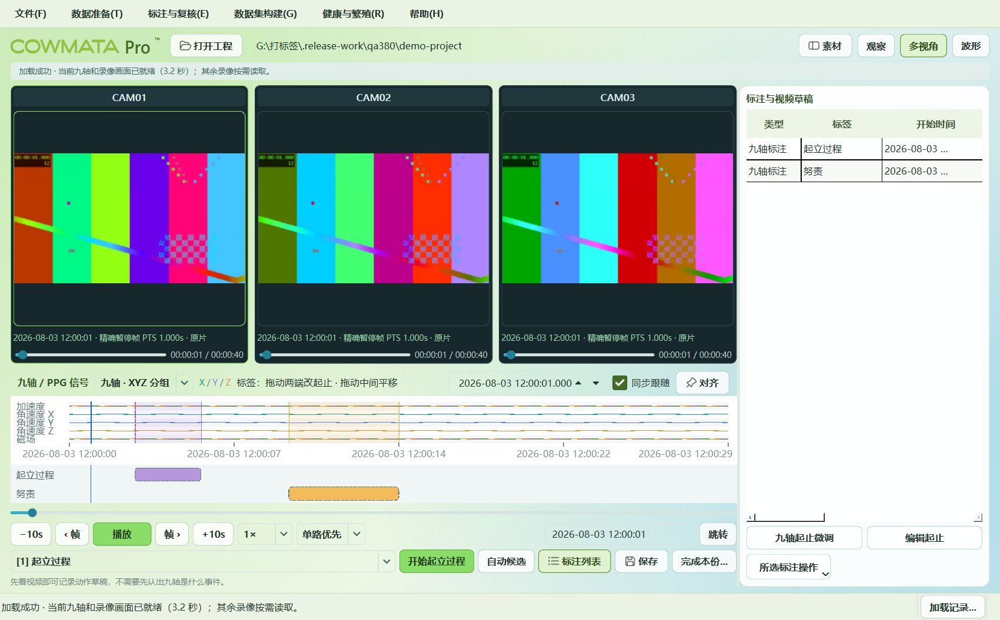

# COWMATA Pro™ 3.8

**Organize original recordings, accelerate human annotation, and build complete datasets.** An offline Windows workstation for multiview cattle video, continuous nine-axis IMU and PPG.

[Download 3.8](https://github.com/zxq309/COWMATA-Pro/releases/tag/v3.8.0) · [Illustrated guide](https://zxq309.github.io/COWMATA-Pro/operator-guide-380.html) · [简体中文](README.zh-CN.md) · [Project overview](docs/project/overview.md)

## Workflow

| Menu | Purpose |
|---|---|
| File | Open original data and resume annotation projects |
| Data preparation | Download edge records and classify selected camera views by recording date |
| Annotation and review | Synchronize video and signals, use keyboard labels and model candidates, edit existing annotations |
| Dataset construction | Pair Raw/Label files and export timestamped behavior, calving, estrus, pregnancy and disease datasets |
| Health and reproduction | Retain research entry points and show actual model availability |
| Help | Tested illustrated instructions, updates and rights notices |

Camera transfers run concurrently with bounded decoding/OCR. Unchanged completed files are reused; paused jobs resume. Independent task windows minimize and restore through the Windows taskbar. Live records preserve selection during refresh.

Candidates require human review. Review edits existing records in place; dataset exports retain prior versions. Legacy feeding annotations remain readable without adding a shortcut.

## Install or run

- **Installer:** run `COWMATA-Pro-3.8.0-Setup.exe`, choose a location and use the **COWMATA Pro™** desktop shortcut.
- **Portable:** extract the entire ZIP, then run `COWMATA.exe` inside `COWMATA-Pro-3.8.0-Portable`.
- **Source:** includes code, tests and the illustrated guide. Use the portable package for the complete offline runtime.

Python, Qt, VLC, FFmpeg and registered models are bundled. Keep acquisition data outside the application folder. Startup does not depend on network access or update checks. Version 3.7 and older should upgrade once using the full installer or portable package.

Each Release has exactly three attachments: source ZIP, portable ZIP and installer EXE. The guide is included.

## Unified project and validation

The former overview, recognition and risk repositories are consolidated here. Project information, training/evaluation methods, temperature/activity evidence and complete histories remain accessible. [Consolidation and provenance](docs/project/repository-consolidation.md) · [Release notes](docs/release-380.md)

Five registered models produced matching outputs in the slim and original runtimes; this validates execution parity, not field accuracy. Downloader protocol checks use a local HTTP server; production connectivity needs the actual endpoint and credentials. Unregistered health/reproduction models do not generate placeholder predictions.

Development: `python -m pip install -e ".[dev]"`, then `pytest` and `ruff check cowmata_tailring tests`.

COWMATA Pro™ is the product trademark designation. Annotation source retains MIT licensing; corporate marks and historical research materials retain their separate rights. See [LICENSE](LICENSE) and [NOTICE](NOTICE).
