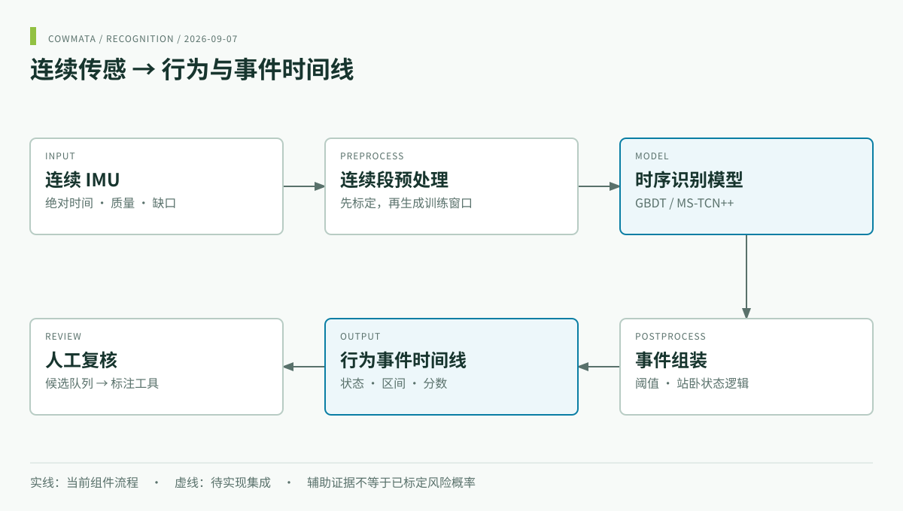

<div align="center">
<a href="https://www.cowmata.com/"></a>

# COWMATA · 牛只行为与事件识别

**连续 IMU → 姿态状态、事件区间与复核候选。**

[](https://github.com/zxq309/cowmata-tailring/actions/workflows/ci.yml)


[English](README.md) · [简体中文](README.zh-CN.md) · [COWMATA](https://github.com/zxq309/cowmata)

</div>



## 最新更新

**2026-09-07** — 首页聚焦行为事件识别，新增双语流水线图；总体产品图文迁至 [cowmata](https://github.com/zxq309/cowmata)，保留 Windows 模型路径修复。[完整更新记录](CHANGELOG.md)。最近的软件发布版本仍为 [v0.3.1](https://github.com/zxq309/cowmata-tailring/releases/tag/v0.3.1)，本次文档更新没有重训模型。

## 识别范围与输出

本仓负责连续行为识别：预处理、特征与模型训练、推理、事件组装以及按牛独立评估。繁殖与健康决策在 [cowmata-risk](https://github.com/zxq309/cowmata-risk) 维护，总体产品路线图在 [cowmata](https://github.com/zxq309/cowmata) 维护。

| 输出 | 代码／格式 |
|---|---|
| 持续状态 | `STANDING`、`LYING`、`WALKING` |
| 姿态转换 | `STANDING_UP`、`LYING_DOWN` |
| 行为事件 | `URINATION`、`DEFECATION`、`TAIL_RAISED` |
| 研究任务头 | `MOUNTING`、`MOUNTED_BY`；接口支持不代表已验证性能 |
| 输出文件 | 稠密概率＋候选事件区间 |

`TAIL_WAGGING` 为兼容旧标签保留读取能力，不进入当前训练。候选需在[标注工具](https://github.com/zxq309/cattle-tail-ring-annotator)中人工确认。

## 快速开始

```sh
git clone https://github.com/zxq309/cowmata-tailring.git
cd cowmata-tailring
conda env create -f environment.yml
conda activate cowmata
python -m pip install -e . --no-deps
cowmata predict --cache-key demo_session_60s --data-root examples/demo_data --out runs/demo
```

内置演示输出 120 个稠密预测点及候选区间，用于检查执行链路，不代表现场准确率。深度训练另需安装适配本机的 PyTorch。 [完整命令与 Python API](docs/QUICKSTART.zh.md).

## 模型与评估

默认标注辅助模型为 `weights/deploy/gbdt_full.joblib`。历史 TCN 检查点仅用于溯源，不是可部署替代模型。版本和 SHA-256 见 [MANIFEST.json](weights/MANIFEST.json)。

保留连续原始数据，不跨越缺口；按牛划分，以独立事件评估。阅读[数据契约](docs/DATA_CONTRACT.md)、[指标定义](docs/METRICS.md)、[实验报告](docs/EXPERIMENTS_20260819.zh-CN.md)和[维护验证](docs/MAINTENANCE_20260907.md)。历史实验仍按原证据边界解释，本次整理不产生新性能结论。

## 数据集

完整监督缓存不进入 Git：体量超出普通 Git 的适用范围，且包含公司、设备与动物标识。它以两个百度网盘归档分发；新克隆所需的其余内容随仓库提供。

| 产物 | 内容 | 大小 | 分发方式 |
|---|---|---|---|
| `supervised_cache/session_cache/` | 132 个连续 50 Hz 会话——schema-2 `signal.i16.npy`（9 通道 int16 计数值）+ `meta.json`（标定、分段、`tail_position`） | ≈ 1.4 GB | [百度网盘 · session_cache](https://pan.baidu.com/s/1lnLpqO_UX5S57zmI1Qf_qw?pwd=u9n4)（提取码 `u9n4`） |
| `supervised_cache/samples.csv` | 351,128 个监督中心点——牛 / 会话 / 分段坐标与逐事件掩码 | ≈ 59 MB | [百度网盘 · samples.csv](https://pan.baidu.com/s/12mj-bflbcekc1x1_HI2NeQ?pwd=s5rd)（提取码 `s5rd`） |
| `supervised_cache/sessions.csv`、`dense_labels.csv.gz` | 会话元数据与 GBDT/深度分支共享的稠密标签帧 | ≈ 7 MB | 随仓库提供 |
| `annotations/`、`loco_splits/`、`development_split/` | 仲裁后标注与奶牛级划分清单 | 小 | 随仓库提供 |
| `examples/demo_data/…/demo_session_60s/` | 60 秒真实会话（schema 1），供克隆后冒烟测试 | ≈ 0.2 MB | 随仓库提供 |

恢复完整缓存：将两个归档解压到 `datasets/cowmata_imu/supervised_cache/`，然后运行：

```bash
cowmata check-data --full-cache-scan
```

这些产物是完整重训练与真实数据诊断所必需的，并非过时缓存垃圾。交付与完整性规则见 [`docs/DATA_ACCESS.md`](docs/DATA_ACCESS.md)。

## 开发验证

```sh
python -m pip install -e ".[dev,gbdt]"
pytest
cowmata predict --cache-key demo_session_60s --data-root examples/demo_data --out runs/check
```

## 仓库导航

- `cowmata/`：识别包；`configs/`、`tests/`：配置与检查。
- `weights/`：版本化模型；`datasets/`：元数据与本地数据说明。
- [快速开始](docs/QUICKSTART.zh.md) · [参考项目](docs/REFERENCE_PROJECTS.md)。
- 历史 `cowmata/daily.py` 和 `experiments/fusion.py` 为兼容与复现暂留，不作为新的在线决策服务；新增决策工作统一进入 cowmata-risk。
- [贡献](CONTRIBUTING.md) · [引用](CITATION.cff) · [安全](SECURITY.md) · [权利声明](NOTICE)。
