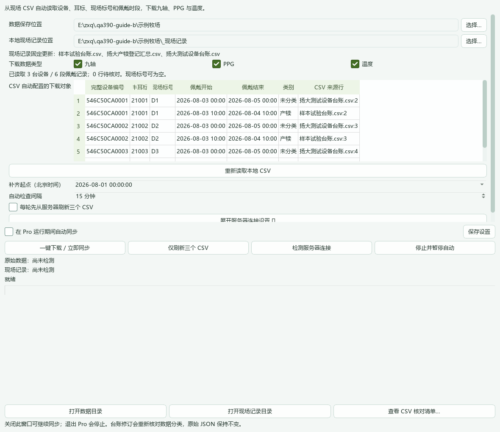
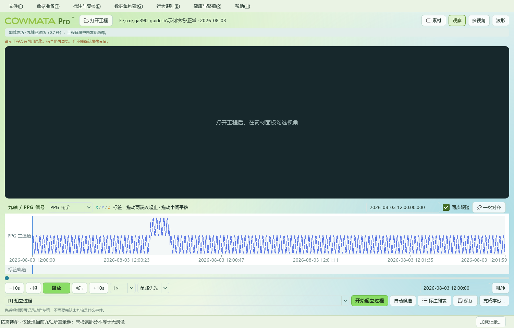
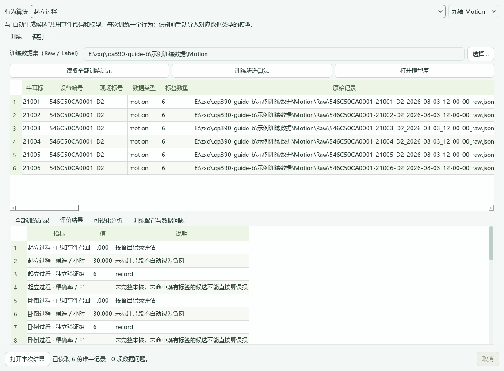
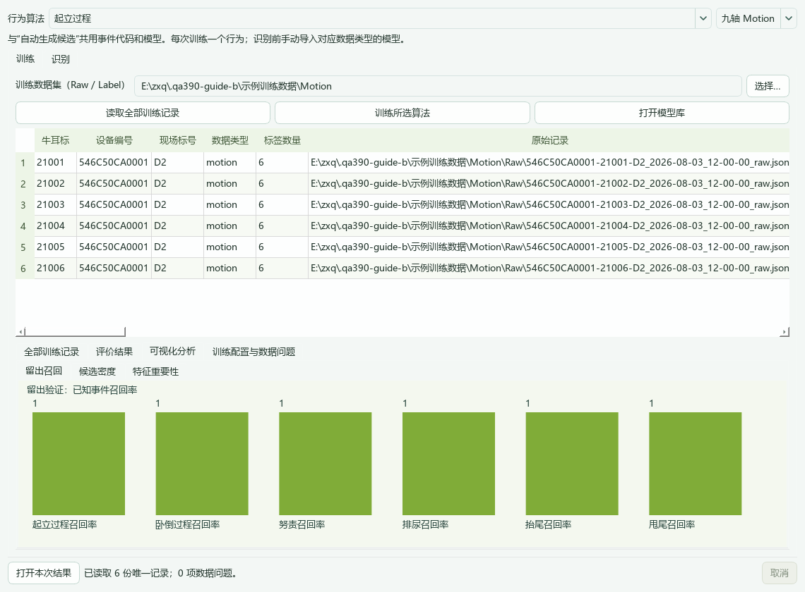
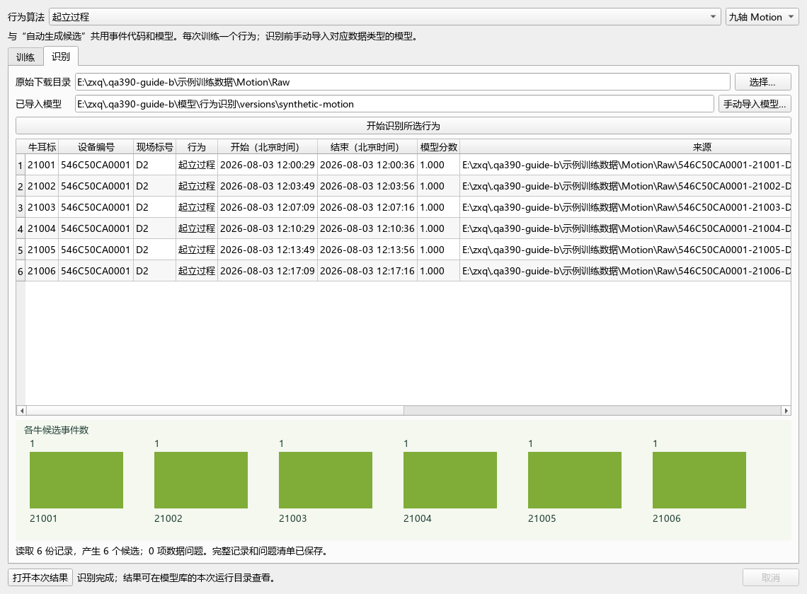
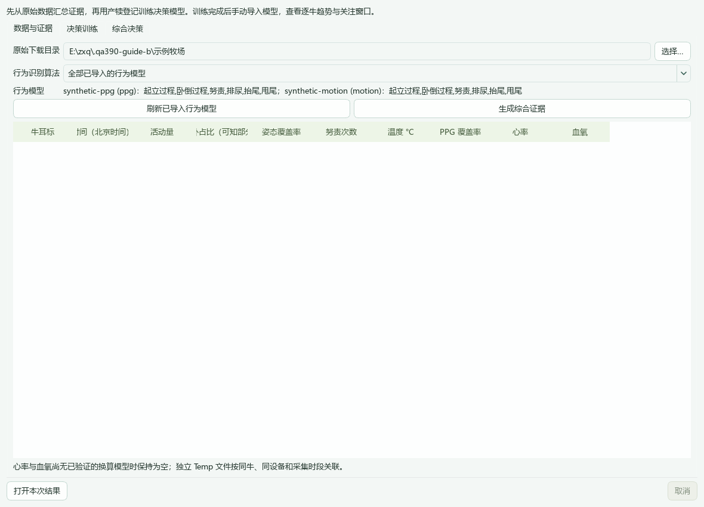
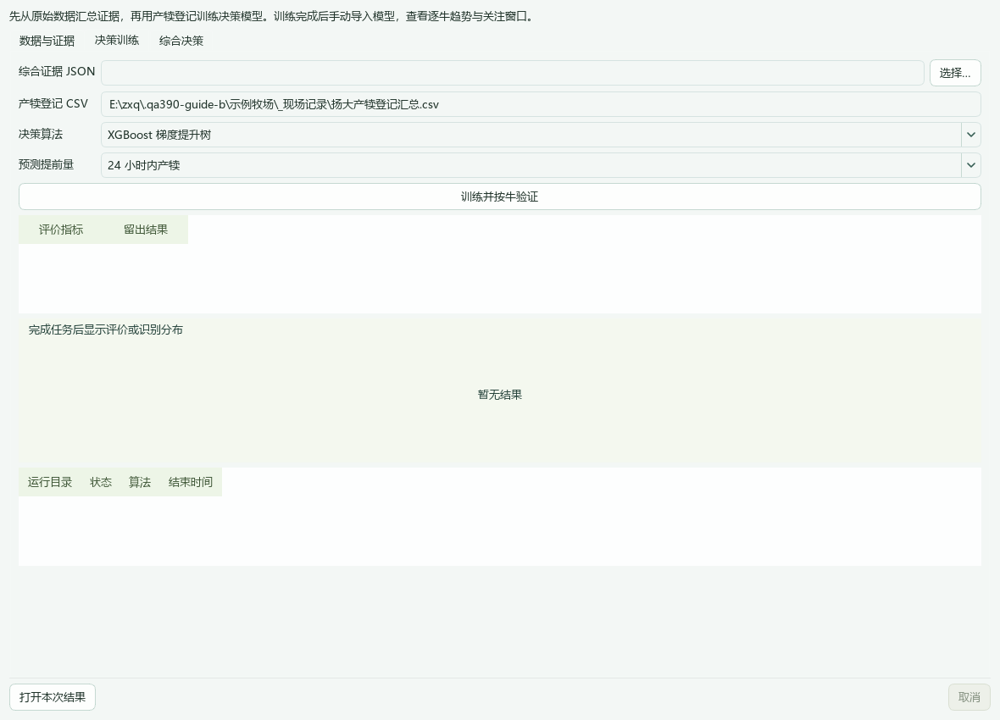

# COWMATA Pro 3.9：新手图文教程

**按这条顺序操作：下载 → 标注 → 导出数据集 → 训练 → 导入模型 → 识别与决策。**

截图来自 3.9 实际运行界面，使用合成台账和信号演示操作；图中训练分数不代表真实牧场效果。

## 1. 先下载数据

打开 **数据准备 → 端侧数据下载**。确认现场记录位置为 `F:\牛舍\_现场记录`。

- 点击 **重新读取本地 CSV**，检查自动列出的设备、牛号和佩戴时段。
- 点击 **检测服务器连接**，然后 **一键下载 / 立即同步**。
- 需要持续更新时，勾选 **在 Pro 运行期间自动同步**。

完整 12 位设备号保持完整；4 位简写自动补前缀。没有现场标号也能下载，无须再填一张手工对象表。

## 2. 打开工程，一次对齐后标注

打开工程，选择日期和 Motion 或 PPG。准备好对应录像，在同一动作处分别停住录像和信号光标，点击 **一次对齐**。

选择行为，设置起止，点击 **保存**。候选要看录像复核后再确认。

这张图演示 PPG 浏览；尚未选择录像时可以查看波形，不能凭波形确认录像真值。

## 3. 导出训练数据集

在 **数据集构建** 中选择行为识别数据集，检查来源并导出。保留成对的 **Raw** 与 **Label** 文件，不单独改名或替换内容。

## 4. 训练一个行为

打开 **行为识别 → 训练与识别**，顶部选行为和九轴/PPG。

选择数据集 → **读取全部训练记录** → **训练所选算法**。完成后查看训练历史、评价和可视化。

模型和报告保存在 `F:\科牧特\_模型`，点击 **打开本次结果** 查看。

## 5. 导入模型，识别原始数据

切到 **识别** → 选择原始下载目录 → **手动导入模型**，选训练结果中的 `suite.json` → **开始识别所选行为**。

九轴和 PPG 分别导入对应模型。同一导入版本也供自动候选与产犊证据使用。

## 6. 做产犊综合决策

打开 **健康与繁殖 → 产犊**：

1. **数据与证据**：选原始数据，点击 **生成综合证据**。
2. **决策训练**：选证据 JSON、精确产犊 CSV、算法和提前量，点击 **训练并按牛验证**。
3. **综合决策**：手动导入训练结果中的 `decision.json`，点击 **开始综合决策**，按牛查看风险与缺失项。

没有可靠心率、血氧或结局记录时保持未知；风险结果应结合现场观察复核。

---

**更新软件：** 帮助 → 版本与更新 → 下载 → 保存退出并更新。旧版无法更新时，可运行新的 Setup，或用新版随附的“修复旧版更新.cmd”选择旧程序和完整 Portable ZIP。

[项目原理、源码配置与训练细节](../README.md) · [数据格式](data-contract-390.md) · [验证记录](validation-390.md)
